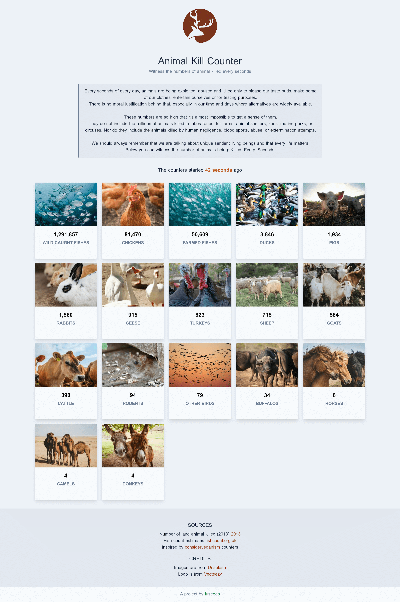

# Animal Kill Counter

> Witness the numbers of animal killed every seconds

<small>You can see a live version at: https://animal-kill-counter.luseeds.com</small>



## About

A project from [luseeds](https://luseeds.com)
The goal is to raise awarness about the industries that kills millions of animals every day.  
The website shows counters about the different kill rates for every animals.

## Build Setup

For detailed explanation on how things work, check out [Nuxt.js docs](https://nuxtjs.org).

```bash
# install dependencies
$ npm install

# serve with hot reload at localhost:3000
$ npm run dev

# build for production and launch server
$ npm run build
$ npm run start

# generate static project
$ npm run generate
```

This website is hosted on [Netlify](https://netlify.com)

---

A project from [luseeds](https://luseeds.com)
